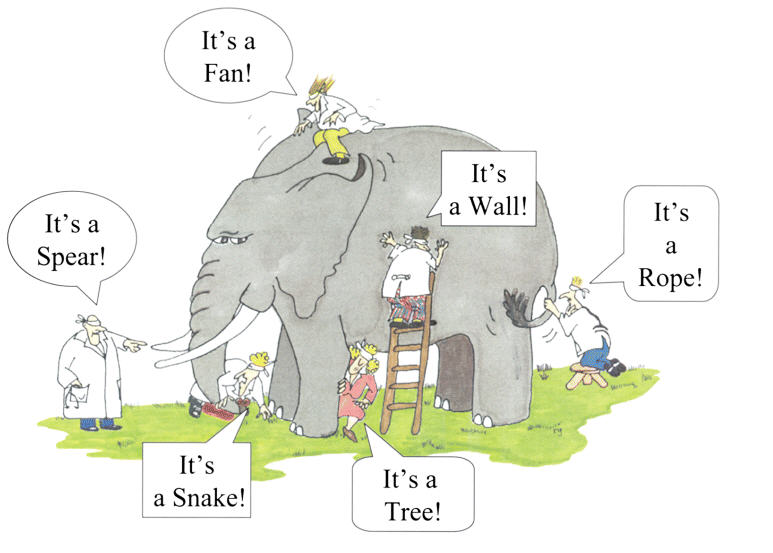

# What *is* Data Science: An Historical Perspective

Given how often the term "data science" gets thrown around, you would be excused for thinking that the meaning of the term was clearly understood. The reality, however, is that if you were to ask ten people working in the field you will almost certainly get ten different descriptions of what it is and what they do.

Part of that is deliberate obfuscation—data science is *so* trendy that everyone wants to claim that what they're doing is data science in order to woo venture capitalists or to win research grants. But it's also the result of the fact that data science is not really a mature discipline in the way that computer science or sociology are mature disciplines. Rather, it's best to think of data science as an ongoing project to bring together a range of disparate innovations in computational and statistically methodology under one roof.

Why is such a project necessary? The exponential increase in data availability and computational power over the past thirty years has resulted in a commensurate explosion in methods for analyzing that data. But the development of many of these methods has occurred in one of the most fragmented institutions in the world—academia—resulting in duplication of efforts, differences in language and vocabulary, and a failure to fully appreciate possible synergies between the perspectives of different disciplines.

The idea that academia is deeply fragmented often surprises students, and understandably so. Universities *love* to pay lip service to the importance of interdisciplinarity, and are quick to highlight successful interdisciplinary collaborations. But successful interdisciplinary collaborations are so notable precisely because they are the exception, not the rule. The reality, is that academic research is starkly divided into disciplinary silos (e.g., computer science, statistics, political science, economics, engineering). This isn't because researchers aren't *interested* in interdisciplinary collaborations, but rather that their professional imperatives push them to focus their attention on the priorities and language of their own departments and disciplines.[^academic_incentives]

[^academic_incentives]: Nearly all university faculty are hired by established departments like statistics or economics, faculty submit their research to journals specific to their discipline, those journals in turn ask fellow members of the discipline to evaluate their work for publication, and promotions and tenure review are managed by the faculty in a faculty member's own department.

Thus, while the past several decades have seen an unprecedented emergence of new methods across all of academia, the lack of intellectual cross-pollination across academic silos has resulted in disciplines failing to take full advantage of discoveries from other disciplines. Over time, each discipline has developed a perspective on computational methods that emphasizes their own intellectual priorities. 

To illustrate, suppose we were interested in using patient data to reduce heart attacks. A computer scientist looking at this problem might use their discipline's methods to *predict* which patients are most likely to experience a heart attack in the future using current patient data; a social scientist might focus on trying to understand the *effect* of giving patients a new drug on heart attack risk; and a statistician might focus on understanding *how confident* we should be in the conclusions reached by the computer scientist and social scientist.

This fragmentation has also resulted in a fragmentation of *language* around data science methodologies. Disciplines often come up with different terminology for the same phenomena, adding another layer of difficulty to efforts to work across departmental silos.

The result is a situation analogous to the Buddhist parable of the blind men and the elephant, wherein a group of blind people come upon an elephant, and upon laying hands on different parts of the elephant, they come to different conclusions about what lies before them. The person touching the tail declares "we have found a rope!", while the person touching the leg declares "we have found a tree!" 

(*Note*: Not sure of original source of this image. [Found it here](https://pursuitofresearch.org/2011/01/19/the-blind-men-and-the-elephant/), but need to figure out rights prior to anything about this becoming commercial! Lots of pics in public domain if needed, but not blindfolded scientists.)

And yet, as the poet John Godfrey Saxe wrote in his poem [*The Blind Men and the Elephant*](https://en.wikipedia.org/wiki/Blind_men_and_an_elephant#John_Godfrey_Saxe) about this parable many centuries later:

> And so these men of Indostan, 
> Disputed loud and long,
> Each in his own opinion
> Exceeding stiff and strong,
> Though each was partly in the right, 
> And all were in the wrong!

In recent years, however, there has been a growing appreciation of how can be gained from pulling together the insights that have been developed in different fields, despite the challenges of language and professional imperatives to such collaborations. And, at least amongst those who are serious about the development of data science as a discipline and not just a buzz world for raising money, is the promise of data science: to unify the different perspectives and methods for analyzing data. Or, to put it more succinctly: to finally see the whole elephant.

## Great Story. Why Should I Care?

So why are we telling you this story? In short, because it's important for you to understand that *most* people you will encounter in the world doing data science were trained in one of these academic silos. That means that depending on who you are working with and how they were trained, they may find your future colleagues using terms you've never heard before, or being confused by some of the concepts you bring up, and it's important for you to understand that that isn't necessarily because *you* don't understand something; it may be because either they're just using different terms for a concept you know, or it may be because you, trained with a more unified perspective, may be aware of concepts that even your more senior colleagues (or rather, especially your more senior colleagues!) were never exposed to.

## The Data Analysis / Software Engineering Distinction

**Need to add discussion about this distinction**