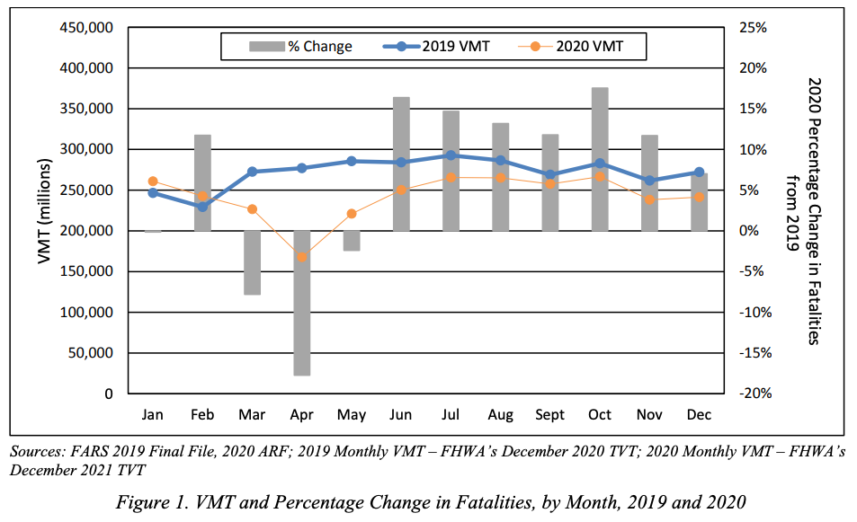

# Answering Exploratory Questions

In our previous readings, we've had a chance to engage with two of the three big ideas of this book: data science is about solving problems, and the way data scientists solve problems is by answering questions about the world. Now it is time to engage with the third big idea in earnest: what differentiates good and great data scientists is their ability to be thoughtful about the ways in which they are likely to be wrong.

Anyone can fit a model that scores well on a target evaluation metric. [Microsoft](https://learn.microsoft.com/en-us/azure/machine-learning/concept-automated-ml?view=azureml-api-2), [Google](https://cloud.google.com/automl), and [Amazon](https://docs.aws.amazon.com/sagemaker/latest/dg/use-auto-ml.html) long ago rolled out tools that could take input data, a target feature, and an evaluation metric and run through a huge number of different types of models to find one that would perform best on that metric. What makes a data scientist valuable is the ability to figure out what they need to model to take in the first place to solve a real world problem, and to be thoughtful about the strengths *and limitations* of different modeling choices *with respect to the real world problem one is trying to solve*.

Throughout Part 3 of this book, we will explore the types of issues that are likely to arise when answering each type of question, starting with discussion of the issues likely to arise when answering Exploratory Questions in this chapter. Elements of these discussions will be similar across question types — such as the idea of *internal* and *external validity* we are about to introduce — but answers to different types of questions tend to be susceptible to different types of problems, so much will also be question specific.

## Internal Validity and External Validity

An organizing principle for all discussion of model limitations is the distinction between internal and external validity. 

**Internal validity** is about how well you have answered your question *in the context of the data and population being studied.* Internal validity should be very familiar to anyone who has taken a statistics of machine learning course — is your regression properly specified? Did you calculate your standard errors correctly? Are the assumptions underlying your model met by the data?

**External validity**, by contrast, is about how well the conclusions and parameter estimates from your analysis will generalize to a different context. This drug worked well in a study of young adults in California; will it also work for elderly patients in Nepal? Our stores in Argentina added this new dish to their menu and sales skyrocketed; would the same thing happen if we added it to menus in Brazil? In current data, users were more satisfied with search results to websites that had more text; if we start up-ranking websites with more text, will that make customers happier (or will Search Engine Optimization (SEO) operations just start filling spam sites with LLM-generated slop)?

## Why External Validity Often Gets Short Shrift

Understanding both internal and external validity is critically important to being a successful data scientist. In general, however, my experience has been that data science students tend to be better trained to evaluate the internal validity of an analysis than its external validity. 

One reason for this may be that it is harder to evaluate external validity using statistical methods, causing some instructors to think of it as "outside the scope" of a statistics or machine learning course. But the second reason I suspect this occurs is more subtle: while a given analysis may be said to have good or bad *internal* validity, it cannot be said to have good or bad *external* validity. Rather, the external validity of a study can only be evaluated *with respect to the specific context to which one wishes to generalize the findings.*

```{sidebar}
The external validity of a study can only be evaluated with respect to the specific context to which one wishes to generalize the findings.
```

This means that external validity is different from internal validity in an important way: when faced with the same facts about a study, everyone should *generally* agree on the internal validity of a study, but the external validity of a study really depends on how you want to use the results. A study of medical care provided to Duke undergraduates may have very *good* external validity with respect to undergraduate students at Emory, UNC, Vanderbilt, and other elite universities with associated research hospitals (that is, the conclusion of the study of Duke students is likely to also be valid for those other students). But that same study may have *poor* external validity with respect to lower income students attending community colleges that have less comprehensive student health insurance and no top-tier associated hospital system. And it would certainly have terrible external validity with respect to all Americans, never mind people living in other countries.

## Interval v. External Validity: An Example

To illustrate what is meant by these terms, suppose you've been hired by a car manufacturer. Through extensive market research, they have determined that if they can improve the safety of their cars, they could dramatically improve the image of their brand. They have turned to you, their in-house data scientist, to help them determine what safety enhancements they should focus on developing.

To help them prioritize their efforts, you decide it would be useful to begin by better understanding the predominant causes of major accidents. After all, if 95% of accidents were caused by mechanical failures, bad weather, and drunk drivers, then even a perfect system for preventing drowsy driving accidents could only reduce accidents by 5% at best![^safety_v_customer_perceptions]

[^safety_v_customer_perceptions]: It is worth noting that if the goal of the company is to improve brand image and sales — rather than improve safety as much as possible — then what matters is not what *actually* causes the most accidents, but rather what customer *perceive* causes the most accidents. But let us assume — for the sake of this exercise — that your employer's interest in reducing accidents is sincere. If there is a divergence between customer perceptions and the reality of accident causes, that could be addressed with additional information embedded in any advertisements of the feature being developed.

The best source of accident investigations of which you are aware is the [US National Highway Traffic Safety Administration's](https://www.nhtsa.gov/data) National Center for Statistics and Analysis (NCSA). Using their *Crash Reporting Sampling System*, the NCSA collects and publishes data from "nationally representative sample of police-reported traffic crashes, which estimates the number of police-reported injury crashes and property-damage-only crashes in the United States," as well as data on all fatal accidents collected through their *Fatality Analysis Reporting System*.

The NCSA provides you with data on police-reported accidents from the Crash Reporting Sampling System and all fatal accidents from the Fatality Analysis Reporting System from the past 5 years (2018-2023). As you turn to using this data to analyze the causes of severe accidents for your stakeholder, what internal and external validity concerns might you have in the back of your mind?

### Internal Validity Concerns

Internal validity concerns, in this context, relate to your ability to properly characterize the causes of severe accidents in this data. The first of these concerns are those discussed in our previous two readings — namely, whether the summarizations of accident cause you generate from this data are meaningful and faithful representations of the patterns in the data.

But internal validity concerns also extend to things like concerns over the accuracy with which things are measured. For example, it's reasonable to ask "How well do police accident reports capture the true causes of an accident?" Some factors — like whether a driver was intoxicated — are easy to verify after the fact in major accidents. Other factors, however, may have contributed to accidents — and be easier to address with driver assistance systems — but may have been too hard to verify for the police to put in their reports. For example, maybe weak headlights prevented the driver from seeing a change in the speed limit (causing the documented cause of the accident: speeding). Or perhaps one driver was unable to see an approaching vehicle on a cross street due to width of the A-piller (that piece of metal running vertically between the front windshield and front side window). Or "weather" may be invoked as a cause in an accident when what was really at play was that the driver had the wipers on too low of a setting (and automatic wipers would have adjusted more quickly, preventing the accident).

All of these are question about whether our summarization of the **data** provides a proper characterization of **the world** for the period and group we think are covered.

### External Validity Concerns

But worrying about whether we really understand the world covered by our data is only half the battle. After all, our stakeholders aren't planning to go back in time 5 years and add a new driver safety system to their cars starting in 2018; they're thinking of developing this safety system to use *in the future*. So what do we think is the *external validity* of findings from 2018-2023 to the next ten years?

To answer this question, we need to consider how the next ten years might differ from the last five *in ways that are relevant to the phenomenon we care about* (here, the causes of car accidents).

First, since time will have passed between when the crash data was collected and when the new feature rolls out, one might reasonably assume that trends in accident causes during the 2018-2023 period are likely to continue. In light of that, a thoughtful data scientist may wish to pay extra attention to whether there are clear *trends* in accident causes, and in what direction they are trending.

But one might also pause to ask whether there was anything exceptional about the "data generating process" during the 2018-2023 period that would not obtain in later years. Something like... a pandemic?

And indeed, one would be right to worry. The figure below shows Vehicle Miles Travelled (VMT) and Fatalities in 2019 (pre-pandemic) and 2020 (the pandemic began in force in March, if you've forgotten). As the figure shows, driving plummeted during this period, and so too did Fatalities.



Source: Taken from the US Department of Transportation NHTSA's [*Overview of Motor Vehicle Crashes in 2020*](https://crashstats.nhtsa.dot.gov/Api/Public/ViewPublication/813266)

Given that, a thoughtful data scientist may wish to be sure that any patterns identified in this five-year period are robust to exclusion of 2020-2022 before making any predictions about the likelihood these patterns would persist in later years.

#### Other Contexts

The preceding discussion assumed an interest in US accidents, but of course most car companies that sell cars in the US also sell cars in Asia and Europe. The issues raised above are examples of what I would contend are relatively *small* threats to the external validity of findings based on data from 2018-2023 with respect to near-future US accidents (at least provided the patterns aren't driven by the pandemic period).

But external validity to Asian or European markets would be a much bigger concern. Because traffic laws, speed limits, alcohol laws, and how roads are constructed and laid out are all very different in different regions of the world, it seems quite unlikely that patterns identified in US accident data would have much external validity to Asian or European auto markets.

## Conclusion

Internal and External Validity are both key concepts for being an effective data scientist, and they are concepts to which we will return regularly in this book. Moreover, they are goals that are sometimes in tension — the more control one has over a study context, the more likely one is to have good Internal Validity; but that control can often create an artificiality to limits External Validity. Thus Internal and External Validity should not necessarily be thought of as things to try and simultaneously maximize at all costs; rather, they are best thought of as distinct features of any analysis that should always be considered. I would also add that, of the two, I would argue that External Validity — while not more important in and of itself — is the more often overlooked.
