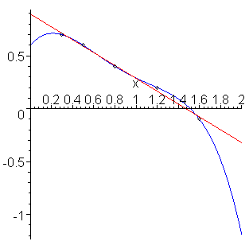

# Passive Prediction Questions and External Validity

Where *internal validity* is a measure of how well a model captures the meaningful variation in the data we already have, *external validity* is a measure of how well we think that our model is likely to perform when faced with new data.

As we learned before, the external validity of a model is specific to the context in which a model is being used. A model will generally have very *high* external validity when used to answer Passive-Prediction Questions in a setting that is very similar to the setting from which the data used to train the model was collected, but *low* external validity when applied in geographically, temporally, or socially different settings.

Some of the factors that influence the External Validity to Passive Prediction Questions are the same as those that shape the External Validity of Exploratory Questions, such as the population represented in the data (patterns in data from one country will often differ from patterns in data from another country), the time period in question (consumer behavior may vary across seasons, and many patterns in data change over longer timespans). But there are other concerns that are a little more specific to Passive Prediction Questions:

## Extrapolation and Training Parameter Ranges

Tools for evaluating internal validity help ensure that statistical and machine learning models will tend to fit the data on which they are trained relatively well. However, while most statistical models are capable of generating predicted values over a very broad range of input values, their reliable outside the range of values on which they were trained is often very limited. Asking a model to make predictions for inputs on which the model wasn't trained is called *extrapolating*, and is a great way to get oneself into trouble.

To illustrate, consider the two models in the figure below ([source](https://ece.uwaterloo.ca/~dwharder/NumericalAnalysis/06LeastSquares/extrapolation/complete.html))—one a linear fit, and one a higher-order polynomial. Both model the data similarly *in the range for which data is available* — and so will perform similarly when one uses the metrics described above to evaluate the model's internal validity — but make very different predictions when asked to extrapolate values of `x` below 0 or above 2.



In addition to reducing overfitting, strategies like regularization are designed to constrain the "wonkiness" of models outside the domain on which they were trained, but almost by definition, absent data in those extended ranges, there's no way to know for certain whether the model will generalize.

### What Constitutes Extrapolation?

In the example above, the term extrapolation refers to predicting values below 0 and above 2. But what constitutes an extrapolation depends in part on the complexity of the model. With a nice, interpretable linear model, it's not hard to have confidence that the model will make a reasonable prediction for $x=0.5$, even though that specific value wasn't in the training data. But when one begins to work with highly non-linear models that allow for interactions and aren't easily interpretable — such as deep learning neural networks — the only place one can feel sure of the behavior of the model is at the exact data points in the training data. The same flexibility that allows these models to accommodate unusual non-linear relationships can also lead to bizarre behavior between actual points in the training data. A credit risk model may make perfectly reasonable predictions for a married 45-year-old women of Hispanic descent who lives in Colorado and a married 47-year-old women of Hispanic descent who lives in Colorado because both of those profiles were present in the training data, but make a crazy prediction for a a married 46-year-old women of Hispanic descent who lives in Colorado or a married 45-year-old women of Hispanic descent who lives in Montana.

Indeed, it's precisely for this reason that for many high stakes decisions, regulators are increasingly requiring the use of interpretable models that include guarantees (like monotonicity).

Basically, the more flexible the model, the more data points are required to constrain the model's behavior (the so-called "curse of dimensionality"), and the more cautious you should become. There's a reason that LLMs hallucinate despite being fed unfathomably large amounts of data.

```{note}
A common misconception among young data scientists is that the split-train-test workflow commonly used in machine learning innoculates against external validity concerns. After all, the idea of split-train-test is that models are trained on one set of observations and evaluated against an entirely different set of observations.

While split-train-test can *help* reduce external validity concerns by guarding against over-fitting, a fundamental limitation of the workflow is that training observations and test observations both come from the *same context*. Indeed, because test and training datasets are created by taking a single dataset and randomly splitting the observations, they *should* always have the same properties (at least in expectation) — a guarantee one certainly won't get when moving from the data used to build a model to a real world deployment.
```

## Adversarial Users

Another external validity concern for Passive Prediction Models is *adversarial users*. Adversarial users are users who deliberately attempt to subvert a statistical or machine learning model. The idea of adversarial users might seem like the stuff of spy novels, but they're actually *much* more common than you might think.

To illustrate, consider the Essay RoboGrader. Training an algorithm to answer the question "if a human English professor read this essay, what score would they give it?" is relatively straightforward — get a bunch of essays, give them to some English professors, then fit a supervised machine learning algorithm to that training data. What could go wrong?

The problem with this strategy is that the training data was generated by humans *who knew they were writing essays for humans to read*. As a result, they wrote good essays. The machine learning algorithm then looked for correlations between human essay rankings and features of the essays, and as a result it could easily predict essay scores, at least on a coarse scale.

But what happens when humans realize they aren't being graded by humans? Well, now instead of writing for a human, they will write for the algorithm. They figure out what the algorithm rewards — big, polysyllabic words (don't worry, doesn't matter if they're used correctly), long sentences, and connecting phrases like "however" — and stuff them into their essays.[^robograders]

[^robograders]: I cannot for the life of me find the podcast where I first discovered this phenomenon being discussed, but it had lots of great colorful examples of school kids doing this. For now all I can find are these articles: [here](https://www.wbur.org/hereandnow/2020/09/03/online-learning-algorithm), [here](https://www.npr.org/2018/06/30/624373367/more-states-opting-to-robo-grade-student-essays-by-computer), [here](https://www.theverge.com/2012/4/23/2969331/erater-robotic-essay-grader-effectiveness), [here](https://www.nytimes.com/2012/04/23/education/robo-readers-used-to-grade-test-essays.html) and [here](https://www.vice.com/en/article/pa7dj9/flawed-algorithms-are-grading-millions-of-students-essays).

This works because the essay writers who used polysyllabic words and long sentences in the training data happened to also be the students who were writing good essays. These were reliable predictors of scores in essays people wrote for humans. But they *aren't* a reliable predictor of essay quality in a world where students know the essays *aren't* being written for humans, just machines.

Another way of thinking about this is that we're back to the classic problem of alignment problems: they *want* the algorithm to reward good writing, but that's not actually what they trained it to do. In this case, however, the alignment problem is rearing its head because people are actively trying to exploit this difference.

While these examples are fun, not all are, and adversarial users is a HUGE and never ending problem for spam filters, network intrusion detection, credit and fraud monitoring, and more.

### Goodhart's Law, Cambell's Law, and the Lucas Critique

It's worth noting that the threat of adversarial users is not a new phenomenon unique to the age of machine learning. Indeed, the idea of adversarial users is closely linked to at least three much older ideas:

> "When a measure becomes a target, it ceases to be a good measure."

- [Goodhart's Law, named for Charles Goodhart.](https://en.wikipedia.org/wiki/Goodhart%27s_law)

> "The more any quantitative social indicator is used for social decision-making, the more subject it will be to corruption pressures and the more apt it will be to distort and corrupt the social processes it is intended to monitor"

- [Campbell's Law, named for Donald Campbell](https://en.wikipedia.org/wiki/Campbell%27s_law)

> "Given that the structure of any [statistical] model consists of optimal decision rules of economic agents, and that optimal decision rules vary systematically with changes in the structure of series relevant to the decision maker, it follows that any change in policy will systematically alter the structure of [statistical] models."

- [Lucas Critique, named for Robert Lucas](https://en.wikipedia.org/wiki/Lucas_critique)

And since no idea is serious until it's been importalized in an XKCD comic:


