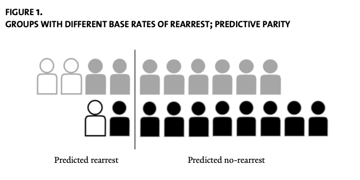
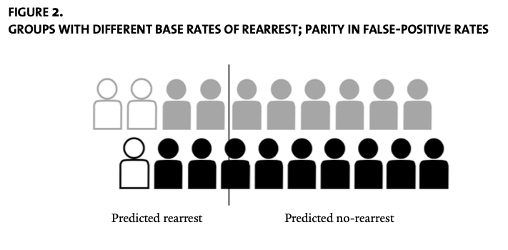
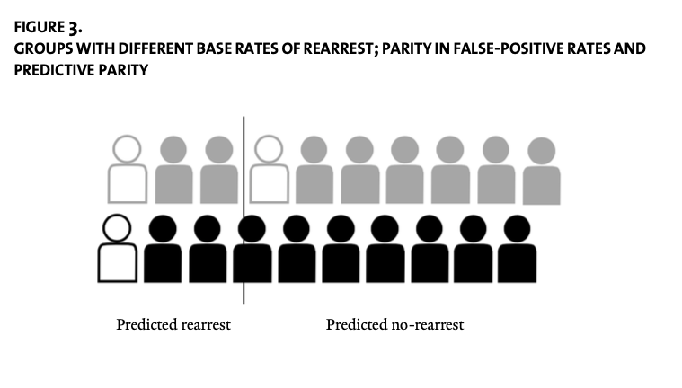

# Fairness and Passive Prediction

*How* our models make mistakes is often just as important as the number of mistakes they make, and not just for financial reasons. Statistical models increasingly inform a range of high-stakes decisions — like who should get a donated organ, or whether a criminal defendant is entitled to bail. In these situations, the question of who bears the costs of model errors can be an ethically fraught question.

To illustrate the ethical questions that arise when deciding what constitutes "fair" when it comes to models that answer Passive Prediction Questions, let's consider the example of Risk Assessment models. Risk Assessment models are models used in the US criminal justice system to answer the question "if this criminal defendant (or incarcerated person) was released from custody, what is the likelihood they would re-offend within the next X months?" These models are used by judges and parole boards who must determine whether arrested individuals should be released while they await trial and whether incarcerated individuals should be paroled (released before the end of their prison sentence to a half-way house or monitored release).

The way Risk Assessment models are used in the US raises many questions, many outside the scope of this section. But one aspect of risk assessment models recently garnered a lot of attention: whether their misclassifications (cases where an individual the model identified as low risk re-offends, or where an individual the model identified as high risk does not re-offend) are racially biased.

The issue of racial bias in misclassifications rose to prominence in 2016 when the investigative news outlet [ProPublica](https://propublica.org) published an analysis of the COMPAS Risk Model — one of the most commonly used risk assessment models in the United States. The article — entitled [Machine Bias](https://www.propublica.org/article/machine-bias-risk-assessments-in-criminal-sentencing) — concluded, in part, [that:](https://www.propublica.org/article/how-we-analyzed-the-compas-recidivism-algorithm)

> Black defendants were often predicted to be at a higher risk of recidivism than they actually were. Our analysis found that black defendants who did not recidivate [are newly arrested for committing a crime in the future] over a two-year period were nearly twice as likely to be misclassified as higher risk compared to their white counterparts (45 percent vs. 23 percent).

In other words, the false positive rate (the share of people not re-arrested predicted to be re-arrested) for Black defendants was higher than it was for White defendants.[^capitalize_white]

[^capitalize_white]: I subscribe to the view — excellently articulated by [Kwame Anthony Appiah here](https://www.theatlantic.com/ideas/archive/2020/06/time-to-capitalize-blackand-white/613159/?gift=UgvUqS8sUm995p-gPKiVO6whYuC5Y-UXWiJvvQg3jaU&utm_source=copy-link&utm_medium=social&utm_campaign=share) — that White should be capitalized in the same manner as Black.

While apparently rather damning, COMPAS' response was that this was actually a consequence of the fact that their model generated equal Positive Predictive rates across Black and White defendants (the share predicted to be re-arrested that are re-arrested is the same for both Black and White defendents). And while I am generally loath to defend COMPAS, in this particular case they have a point.

As explored by [Sandra Mayson](https://www.law.upenn.edu/faculty/sgmayson) in a [2019 Yale Law Journal](https://www.yalelawjournal.org/article/bias-in-bias-out) article, the problem is that more Black defendants end up being re-arrested in the future than White defendants (in other words, the outcome of interest is imbalanced by race). This, in turn, imposes a simple, mechanical limit on the ability of the model to achieve racial balance in all error rates for reasons discussed below.

```{note}
In the discussion of imbalanced recitivism arrest rates, I said *arrested for* recitivism — a huge problem with all of these risk assessment models is that we know from many studies that even in situations where Black and White Americans *commit* crimes at similar rates (like drug use), Black Americans are substantially more likely to be *arrested* for those crimes. Thus, an imbalance in arrests for recitivism do not necessarily imply differences in *actual* recitivism.

Indeed, this form of inequity is also a problem on the input side — Risk Assessment models take into account whether a defendant has prior convictions, but given Black Americans are more likely to be arrested even in situations where were know criminal behavior occurs at similar rates for Black and White Americans, and Black Americans are likely to have lower-incomes and thus less likely to have lawyers who can get charges dismissed, these models tend to treat them as higher risk.
```

## Error Rates and Risk Models

To illustrate the problem, Mayson's paper asks the reader time imagine two groups: grey and black. There are ten figures in each group, and the figures are drawn as solid outlines for individuals who are not eventually re-arrested ("negatives"), while hollow figures are those who are eventually re-arrested ("positives"). In the grey group, 2/10 individuals are eventually re-arrested, while only 1/10 are re-arrested in the black group. 

The goal of the risk model, therefore, is to predict which figures are most likely to be re-arrested. The vertical line in the figure represents the classification threshold used by the model (the probability cutoff used to convert continuous imputed probabilities into discrete classifications) — those to the left of the vertical line are those the model has predicted are likely to be re-arrested, while those to the right are those it predicts are unlikely to be re-arrested.



```{note}
Confusingly, this coloring implies the grey figures are more likely to be re-arrested, meaning they are in the position of Black Americans while the black figures are in the position of White Americans. Mason made this choice to abstract from the specifics of the racial groups in question, but to be honest I think that just confuses the matter for readers and distracts from the empirical realities. I will use the terms "grey figures" and "black figures" to refer to the illustrative entities in these pictures (note I use the lower case and the term "figures").
```

For many data scientists, it will be helpful to think about how this figure relates to a traditional confusion matrix, like the one below:

|                | Predicted Positive | Predicted Negative |
|----------------|--------------------|--------------------|
| Actual Positive| True Positive (TP) | False Negative (FN)|
| Actual Negative| False Positive (FP)| True Negative (TN) |

Where the entire population consists of $P + N$, where $P = TP + FN$ and $N = FP + TN$.

In the image above, there are two True Positives (TP) and two False Positives (FP) for the grey figures. For the black figures, there is one True Positive and one False Positive. 

With the threshold in the location shown in the figure, the model classifies four grey figures and two black figures as "likely to be rearrested." We also see that for both the grey and black figures, the Positive Predictive value of the model ($\frac{TP}{TP + FP}$, or the share of entities predicted to be re-arrested who are re-arrested) is 50%. Mason refers to this as a model that achieves "Predictive Parity."

But to achieve this "Predictive Parity," the *False* Positive Rate ($\frac{FP}{N}$, or the share of people who are not eventually re-arrested who are *predicted* to be re-arrested) is higher for the grey figures ($\frac{2}{8} = 25\%$) than the black figures ($\frac{1}{9} = 11\%$).

Thus while the ProPublica finding is true — the False Positive Rate of COMPAS is higher for Black defendants — the only way to even this out would be to shift the classification threshold for the black outlines over, reducing the number of grey figures who are not actually re-arrested who are predicted to be re-arrested.



This balances the False Positive Rates for the two groups, but in doing so results in the Positive Predictive value of the model being lower for the black outlines.

Can we do better? Well, we could get equal Positive Predictive value and False Positive Rates for grey and black, but only by accepting differential False *Negative* rates ($FN/P$, or the share of people who are eventually re-arrested the model predicts will not be re-arrested), as illustrated in Mayson's Figure 3 (in which the False Negative rate for grey is 1/2 = 50% black is 0/1 = 0%):



As Mayson writes:

> As this example illustrates, if the base rate of the predicted outcome differs across racial groups, it is impossible to achieve (1) predictive parity; (2) parity in false-positive rates; and (3) parity in false-negative rates at the same time (unless prediction is perfect, which it never is). Computer scientists have provided mathematical proofs of this fact.[^impossibility] When base rates differ, we must prioritize one of these metrics at the expense of another. Race neutrality is not attainable.

[^impossibility]: See Alexandra Chouldechova, *Fair Prediction with Disparate Impact: A Study of Bias in Recidivism Prediction Instruments*, 5 BIG DATA 153 (2017) and Jon Kleinberg et al., *Inherent Trade-offs in the Fair Determination of Risk Scores*, LEIBNIZ INT'L PROC. INFORMATICS, Jan. 2017, at 43:1, 43:4.

So what's the "right" answer? What's the "fair" way to distribute errors? Should the model strive to have the same Positive Predictive value for White and Black defendents? Or the same False Positive rate? Or some balance of the different rates?

The answer is that there is no *right* answer — each of these different schemes is defensible under different ethical frameworks. When you have to make choices about the relative desirability ("value") of different outcomes, you enter the real of ethics and morality, as discussed in our reading on [Prescriptive Questions](05_descriptive_v_prescriptive.md). 

But hopefully, this example makes clear the complexity *and the inescapability* of ethical questions when it comes to the use of data science in high stakes decision making.

